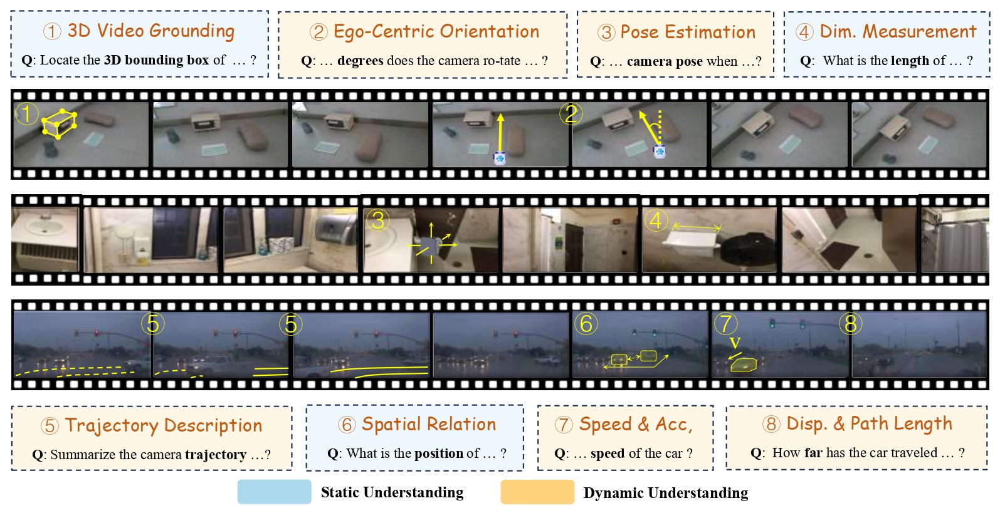
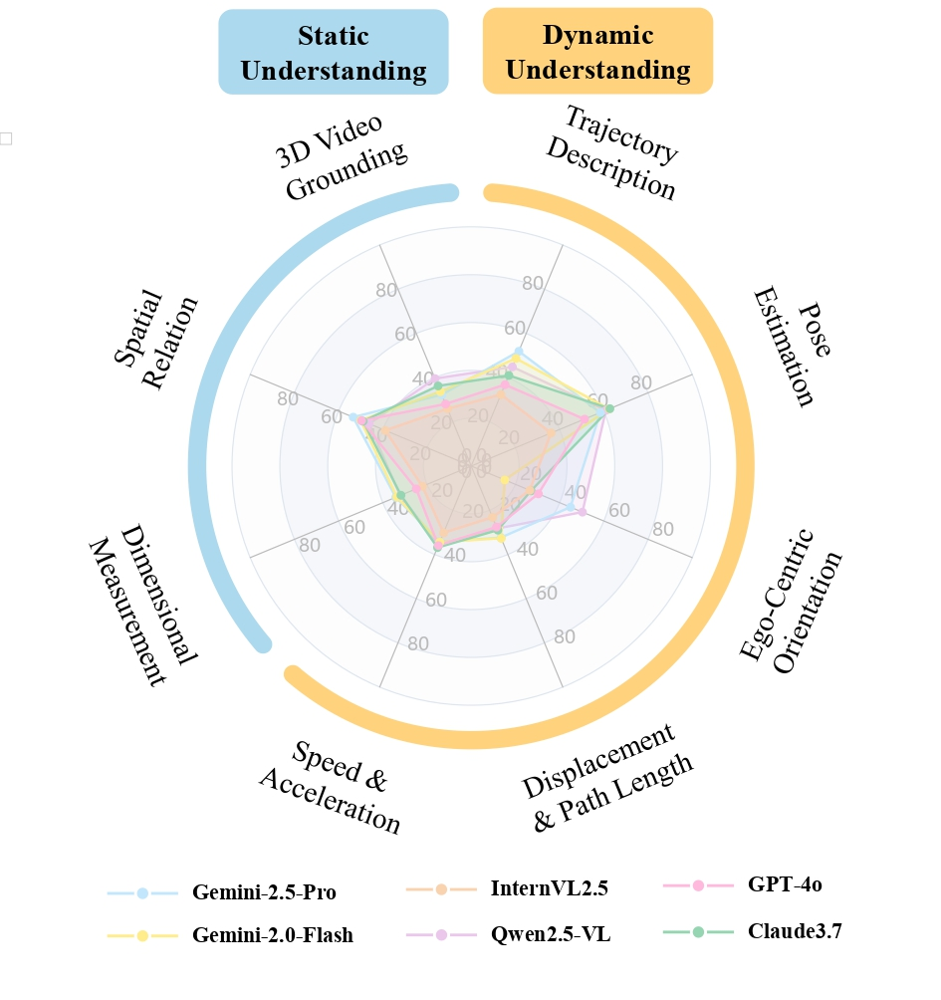

# STI-Bench: Are MLLMs Ready for Precise Spatial-Temporal World Understanding?

<div style="text-align: center">
  <a href="https://arxiv.org/abs/2503.23765"></a>
  <a href="https://huggingface.co/datasets/MIRA-SJTU/STI-Bench"></a>
  <a href="https://github.com/MIRA-SJTU/STI-Bench"></a>
  <a href="https://mira-sjtu.github.io/STI-Bench.io/"></a>
</div>
<div style="text-align: center">
  <a href="https://mp.weixin.qq.com/s/yIRoyI1HbChLZv4GuvI7BQ"></a>
  <a href="https://app.xinhuanet.com/news/article.html?articleId=8af447763b11efc491455eb93a27eac0"></a>
</div>

## Overview

The use of Multimodal Large Language Models (MLLMs) as an end-to-end solution for Embodied AI and Autonomous Driving is a growing trend. However, while MLLMs excel at semantic understanding, their ability to perform precise, quantitative spatial-temporal reasoning in real-world applications remains largely unexamined. To address this gap, we introduce the Spatial-Temporal Intelligence Benchmark (**STI-Bench**), detailed in our paper [*“STI-Bench: Are MLLMs Ready for Precise Spatial-Temporal World Understanding?”*](https://arxiv.org/abs/2503.23765). STI-Bench evaluates MLLMs' spatial-temporal intelligence through challenging tasks on real-world video data, including estimating and predicting object appearance, pose, displacement, and motion. Our benchmark covers diverse robot and vehicle operations across desktop, indoor, and outdoor scenarios. Extensive experiments reveal that even state-of-the-art MLLMs struggle significantly with these tasks, particularly those requiring precise distance estimation and motion analysis, highlighting a critical area for future research and development.



---

## Results

 

---
## RUN Your Own Evaluation

```python
from datasets import load_dataset
sti_bench = load_dataset("MIRA-SJTU/STI-Bench")
```
or you can:

```bash
# Make sure git-lfs is installed (https://git-lfs.com)
git lfs install
git clone https://huggingface.co/datasets/MIRA-SJTU/STI-Bench
```

Test code for openai api and open source models like Qwen 2.5 VL are provided in this repo.

---

## Conclusion

STI-Bench provides a comprehensive benchmark for evaluating MLLMs' spatial-temporal understanding. Our findings reveal significant limitations in current models, particularly in precise quantitative tasks, highlighting inaccuracies in spatial quantification, temporal dynamics understanding, and cross-modal integration. There is a substantial gap between current capabilities and the reliability needed for real-world applications like embodied AI and autonomous driving. STI-Bench serves as a valuable tool for driving progress in developing MLLMs that can accurately perceive and reason about the physical world.

## Citation

```bibtex
@article{li2025sti,
    title={STI-Bench: Are MLLMs Ready for Precise Spatial-Temporal World Understanding?}, 
    author={Yun Li and Yiming Zhang and Tao Lin and XiangRui Liu and Wenxiao Cai and Zheng Liu and Bo Zhao},
    year={2025},
    journal={arXiv preprint arXiv:2503.23765},
}
```
