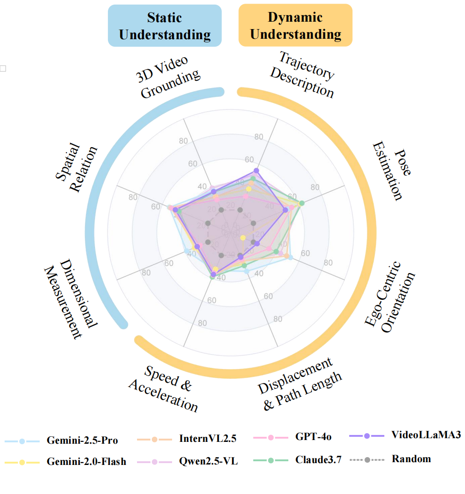

# [ICCV 2025] STI-Bench: Are MLLMs Ready for Precise Spatial-Temporal World Understanding?

<div style="text-align: center">
  <a href="https://arxiv.org/abs/2503.23765"></a>
  <a href="https://huggingface.co/datasets/MINT-SJTU/STI-Bench"></a>
  <a href="https://github.com/MINT-SJTU/STI-Bench"></a>
  <a href="https://mint-sjtu.github.io/STI-Bench.io/"></a>
</div>
<div style="text-align: center">
  <a href="https://mp.weixin.qq.com/s/yIRoyI1HbChLZv4GuvI7BQ"></a>
  <a href="https://app.xinhuanet.com/news/article.html?articleId=8af447763b11efc491455eb93a27eac0"></a>
    <a href="https://mp.weixin.qq.com/s/pVytCfXmcG-Wkg-sOHk_BA"></a>
</div>

## Overview

The use of Multimodal Large Language Models (MLLMs) as an end-to-end solution for Embodied AI and Autonomous Driving is a growing trend. However, while MLLMs excel at semantic understanding, their ability to perform precise, quantitative spatial-temporal reasoning in real-world applications remains largely unexamined. To address this gap, we introduce the Spatial-Temporal Intelligence Benchmark (**STI-Bench**), detailed in our paper [*“STI-Bench: Are MLLMs Ready for Precise Spatial-Temporal World Understanding?”*](https://arxiv.org/abs/2503.23765). STI-Bench evaluates MLLMs' spatial-temporal intelligence through challenging tasks on real-world video data, including estimating and predicting object appearance, pose, displacement, and motion. Our benchmark covers diverse robot and vehicle operations across desktop, indoor, and outdoor scenarios. Extensive experiments reveal that even state-of-the-art MLLMs struggle significantly with these tasks, particularly those requiring precise distance estimation and motion analysis, highlighting a critical area for future research and development.


---

## Results

 

---
## Run Your Own Evaluation

This repository provides reference evaluation scripts, such as `openai_test.py` for the OpenAI API and `opensource_test.py` for open-source models like Qwen2.5VL. These are intended as a starting point for running your own evaluations.

Here is a brief guide to get you started:

### Step 1: Get the Code and Data

First, you need both the evaluation code from this repository and the dataset from Hugging Face.

1.  **Clone the code repository:**
    ```bash
    git clone https://github.com/MINT-SJTU/STI-Bench.git
    cd STI-Bench
    ```

2.  **Download the dataset:** You will need `git-lfs` to handle the large video files.
    
    *Note: We recommend cloning the dataset into a separate parent directory to avoid folder name conflicts.*
    ```bash
    # Make sure git-lfs is installed (https://git-lfs.com)
    git lfs install
    git clone https://huggingface.co/datasets/MINT-SJTU/STI-Bench
    ```
    This will download the `qa.parquet` file and `video.zip`.

### Step 2: Configure and Run

Next, prepare the data and configure the script paths before running the evaluation.

1.  **Prepare Data:** Unzip the `video.zip` file located in the dataset directory you just cloned. This will create a `videos` folder.

2.  **Update Paths:** Open the evaluation script you wish to use (e.g., `opensource_test.py`). Update the `PARQUET_FILE` and `VIDEO_DIR` variables to the absolute paths of your dataset files.
    ```python
    # Example paths to modify in the script
    PARQUET_FILE = "/path/to/your/dataset/STI-Bench/qa.parquet"
    VIDEO_DIR = "/path/to/your/dataset/STI-Bench/videos/"
    ```

3.  **Run Evaluation:** After installing the necessary dependencies for the model, try to execute the script.
    ```bash
    python opensource_test.py
    ```

---

## Conclusion

STI-Bench provides a comprehensive benchmark for evaluating MLLMs' spatial-temporal understanding. Our findings reveal significant limitations in current models, particularly in precise quantitative tasks, highlighting inaccuracies in spatial quantification, temporal dynamics understanding, and cross-modal integration. There is a substantial gap between current capabilities and the reliability needed for real-world applications like embodied AI and autonomous driving. STI-Bench serves as a valuable tool for driving progress in developing MLLMs that can accurately perceive and reason about the physical world.

## Citation

```bibtex
@article{li2025sti,
    title={STI-Bench: Are MLLMs Ready for Precise Spatial-Temporal World Understanding?}, 
    author={Yun Li and Yiming Zhang and Tao Lin and XiangRui Liu and Wenxiao Cai and Zheng Liu and Bo Zhao},
    year={2025},
    journal={arXiv preprint arXiv:2503.23765},
}
```
